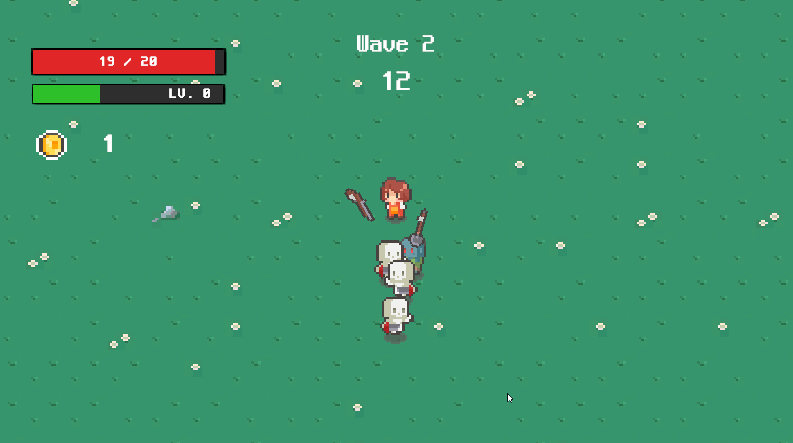
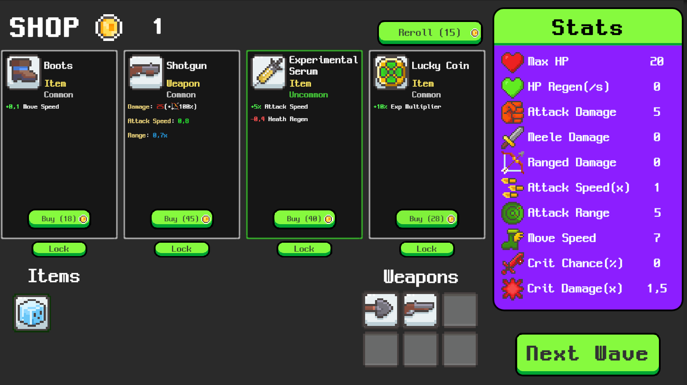
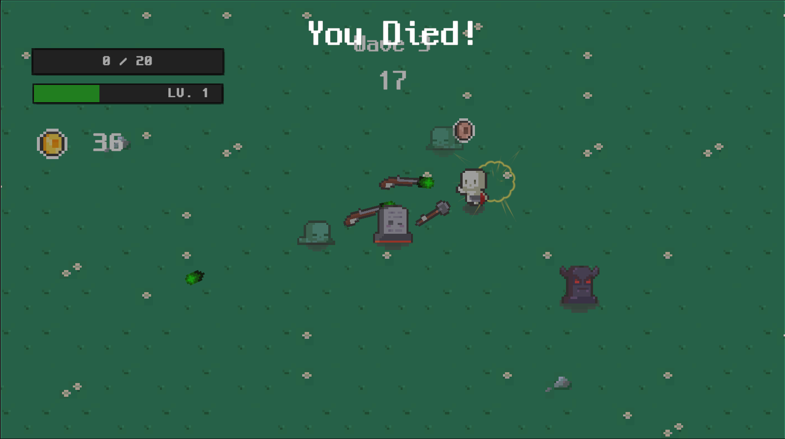

# 🌾 Undead Harvest

> **2D Roguelike / Survivor** built with **Unity 6**

Fight through relentless waves of undead as a fearless farmer armed with
firearms and gardening tools. Purchase upgrades between waves,
experiment with different builds, and survive increasingly difficult
encounters.

---

# 🎥 Gameplay

> **Gameplay Video**

```{=html}
<!-- https://github.com/user-attachments/assets/3176bdfe-f71b-43af-86fa-c495a9c31ff9 -->
```

## 📸 Screenshots

---

 


---

---

# ✨ Features

- Wave-based progression system
- Inventory System
- Status Effects System
- Object Pooling
- Dependency Injection (VContainer)
- ScriptableObject-driven architecture
- Single Entry Point (Bootstrap)
- Shop between waves
- Multiple enemy types and boss encounter

---

# 🛠 Technologies

- Unity 6
- C#
- VContainer
- R3 (Reactive Extensions) (BETA)
- NTC Pool
- DOTween
- Cinemachine

---

## 🚀 Getting Started

```bash
git clone <repository-url>
```

Open the project using **Unity 6**.
